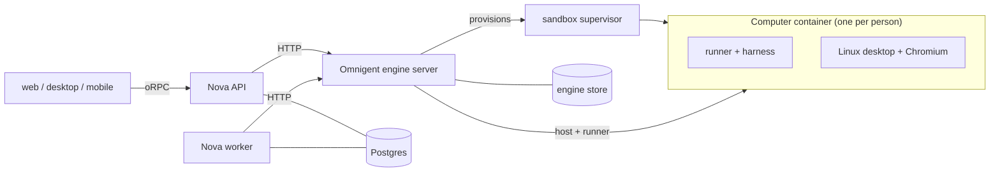

<p align="center">
  
</p>

<h1 align="center">Nova</h1>

<p align="center"><strong>Your AI, already on it.</strong></p>

Nova is one persistent personal agent per person (the Muse) with its own Computer: a Linux desktop
and Chromium you can watch and take over. Hand it a goal and it plans, works in the background,
and comes back when it needs you. It runs on web, desktop (Electron) and mobile (Expo).

Under the hood, a vendored [Omnigent](https://github.com/omnigent-ai/omnigent) engine
(`engine/omnigent`) runs the model loop. Nova never shows Omnigent to the person. The code name
is `aiden` (packages are `@aiden/*`).

## Concepts

One person has one **Muse**, with one **Conversation** (the Super Chat) and one **Computer**. Around
the Conversation sit **Side chats**, **Forks** (a side chat started from one message), **Helpers**
(background workers) and **Memory**. The engine owns all of it; any website can use it. How each
piece works, with the engine routes: [docs/super-chat/README.md](./docs/super-chat/README.md).
Glossary: [CONTEXT.md](./CONTEXT.md).

## Features

- **Conversation and side chats.** One long-running chat that never fills up, plus full-size side
  chats, optionally started with "Knows our conversation".
- **Helpers.** The Muse delegates long or multi-step work to Helpers (`start_helper`): one general
  `worker` that can coordinate sub-workers, on a `fast` or `strong` model. A per-turn step limit
  makes the Muse delegate instead of doing everything inline.
- **Its own Computer.** Watch the screen live, take over and hand back, browse the workspace in the
  Files tab.
- **Artifacts and cards.** Saved files with versions, inline HTML preview, a side panel and the
  Library; reply cards in chat.
- **Memory.** Editable sections, daily notes, background Dreaming and People passes.
- **Goals, Feed, Ideas.** Goals with plans and proposals, followed topics, suggested next steps.
- **Proactivity.** Scheduled Helper runs with quiet hours.
- **Control.** Approvals, a spending cap, an encrypted vault.
- **Teach a task.** Record a demonstration on the Computer; it becomes a reusable skill.
- **Activity panel.** Plain-language steps for everything the Muse did.
- **Harness choice.** Claude SDK by default, or Pi (engine `OMNIGENT_SUPERCHAT_DEFAULT_AGENT=nova-pi`)
  for the whole Muse, Helpers and background work included, which also runs non-Claude models
  through OpenRouter.

## Architecture



- Apps talk only to the Nova API, which authenticates the person and passes calls through to the
  engine as that person.
- The engine owns conversations, side chats, Helpers, memory, schedules, Goals and the Computer
  (ADR 0004). Nova's API relays the screen stream through its same-origin proxy.
- Every turn runs in a runner inside the person's Computer container. The supervisor is the
  plain Docker backend behind the engine's `computer` sandbox provider.

Details: [docs/super-chat/](./docs/super-chat/README.md).

## Repo layout

```text
apps/api          Nova API (Hono + oRPC): auth, ownership, engine relay
apps/worker       Background jobs (Graphile Worker)
apps/web          Web UI, also hosted by the desktop app
apps/desktop      Electron shell
apps/mobile       Expo app
apps/www          Marketing site
packages/         core, contracts (oRPC), db, adapters (incl. omnigent client), auth,
                  chat-ui, ui-tokens, ui-web, adapter-kit, logging, testkit
engine/omnigent   Vendored Omnigent engine (Python)
infra/omnigent    Agent bundle templates and renderer (nova-claude, nova-pi)
infra/sandboxes   Computer image, sandbox supervisor
infra/compose     Docker Compose stacks and deploy scripts
docs/             Setup, architecture, ADRs
```

## Quickstart (local development)

Prerequisites: Node.js 22.22+ and pnpm 9, Python 3.12+ with [uv](https://docs.astral.sh/uv/), and
Docker (Docker Desktop, or colima with about 4 CPUs, 8 GB RAM, 60 GB disk). You need an Anthropic
API key; a Tavily key enables web search.

```bash
# 1. Install and configure
pnpm install
cp .env.example .env            # fill the secrets marked replace-with-...

# 2. Render the agent bundles (after editing infra/omnigent/templates/)
node infra/omnigent/render-agents.mjs

# 3. Build the Computer image (the supervisor does not build it)
pnpm sandbox:build

# 4. Postgres on loopback, then migrate
docker compose --env-file .env \
  -f infra/compose/docker-compose.yml \
  -f infra/compose/docker-compose.postgres-host.yml up -d postgres
pnpm db:migrate

# 5. Engine server (Python); needs the memory extra
uv sync --project engine/omnigent --extra memory
# set the engine environment (see Configuration), then:
uv run --project engine/omnigent omnigent server --host 0.0.0.0 --port 8775 --no-open \
  --config <engine-server-config.yaml>

# 6. Supervisor, API, worker and web (the engine starts a host inside each Computer on demand)
pnpm dev
```

The engine server config names the `computer` sandbox provider and the variables to hand to
runners (`sandbox.runner_env`); the full example, required engine environment and known gaps are
in [docs/super-chat/RUNNERS.md](./docs/super-chat/RUNNERS.md). Point Nova at the engine with
`OMNIGENT_URL` and `OMNIGENT_PROXY_SECRET` in `.env`; the secret must match the engine's
`OMNIGENT_AUTH_HEADER_SECRET`. Then open <http://127.0.0.1:5173>. The first account you create
owns the install.

Before a change lands: `pnpm lint`, `pnpm check`, `pnpm test`.

## Configuration

Set these in `.env` (Nova) or the engine server's environment. Names only; never commit values.

| Variable | Where | Purpose |
| --- | --- | --- |
| `OMNIGENT_URL`, `OMNIGENT_PROXY_SECRET` | Nova API, worker | Engine connection; both required |
| `OMNIGENT_SUPERCHAT_DEFAULT_AGENT` | engine | Bundle a new Muse runs on: `nova-claude`, or `nova-pi` for Pi (Muse, Helpers and background runs) |
| `OMNIGENT_SUPERCHAT_SANDBOX_PROVIDER=computer` | engine | Launch each new Muse on its own Computer |
| `OMNIGENT_AUTH_TENANT_HEADER=X-Omnigent-Tenant` | engine | Header Nova sends the space in on every call; scopes each person's Muse to a space |
| `OMNIGENT_BUILTIN_AGENT_DIRS` | engine | Path-separated bundle dirs under `infra/omnigent/agents/` to seed |
| `NOVA_CLAUDE_MODEL` | engine, runners | Muse model for the Claude bundle |
| `OMNIGENT_HELPER_MODEL_FAST`, `OMNIGENT_HELPER_MODEL_STRONG` | engine, runners | Models behind `fast` and `strong` on the Claude SDK |
| `OMNIGENT_HELPER_MODEL_FAST_PI`, `OMNIGENT_HELPER_MODEL_STRONG_PI` | engine, runners | Optional models behind `fast` and `strong` on Pi; unset, Helpers use the Muse's model |
| `ANTHROPIC_API_KEY` | engine | Claude SDK and engine LLM calls |
| `OPENROUTER_API_KEY` | engine | Non-Claude models on Pi |
| `OPENAI_API_KEY` | engine | Memory search embeddings |
| `TAVILY_API_KEY` | engine | Web search; also set `OMNIGENT_RUNNER_ENV_PASSTHROUGH=TAVILY_API_KEY` |
| `OMNIGENT_AUTH_PROVIDER=header`, `OMNIGENT_AUTH_HEADER_SECRET` | engine | Header auth shared with Nova |
| `OMNIGENT_BROWSER_BACKEND=local` | engine, runners | `browser_*` drives the Computer's own Chromium |
| `OMNIGENT_COMPUTER_SUPERVISOR_URL`, `OMNIGENT_COMPUTER_SUPERVISOR_TOKEN`, `OMNIGENT_COMPUTER_HOME_ROOT` | engine | Where the supervisor is and where Computer homes live |
| `SANDBOX_SUPERVISOR_URL`, `SANDBOX_SUPERVISOR_TOKEN`, `DATA_DIR` | Nova, supervisor | Must match the engine side; `DATA_DIR` is shared |
| `OMNIGENT_VAULT_KEY` | engine | Encrypts the vault |
| `OMNIGENT_PROACTIVE_PROVISION=1` | engine | Daily study and quiet-moment notes |

More settings (rollover, side chat archive, concurrency, timeouts) are in the Settings tables of
[docs/super-chat/README.md](./docs/super-chat/README.md).

## Docs

- [CONTEXT.md](./CONTEXT.md): glossary (Muse, Computer, Helper, Goal, ...)
- [docs/super-chat/](./docs/super-chat/README.md): conversations, side chats, Helpers; [WIRING](./docs/super-chat/WIRING.md) (screens to engine calls), [RUNNERS](./docs/super-chat/RUNNERS.md) (where turns run), [ENGINE-TRIM](./docs/super-chat/ENGINE-TRIM.md)
- [docs/adr/](./docs/adr): architecture decisions
- [docs/pi_futur_work.md](./docs/pi_futur_work.md): Pi harness follow-ups
- [docs/SETUP.md](./docs/SETUP.md), [docs/self-host.md](./docs/self-host.md): Docker Compose and self-hosting (app stack; the engine is run separately)
- [docs/computer-runtime.md](./docs/computer-runtime.md): sandbox provider layer
- [docs/desktop-release.md](./docs/desktop-release.md), [docs/mobile-release.md](./docs/mobile-release.md)
- [CONTRIBUTING.md](./CONTRIBUTING.md), [SECURITY.md](./SECURITY.md)

## License

Nova is under the [Apache License 2.0](./LICENSE); see [NOTICE](./NOTICE) for third-party
attributions. `engine/omnigent` is a vendored copy of Omnigent, Copyright (2026) Databricks, Inc.,
also Apache 2.0; its [LICENSE](./engine/omnigent/LICENSE) and
[NOTICE](./engine/omnigent/NOTICE) stay with it.
