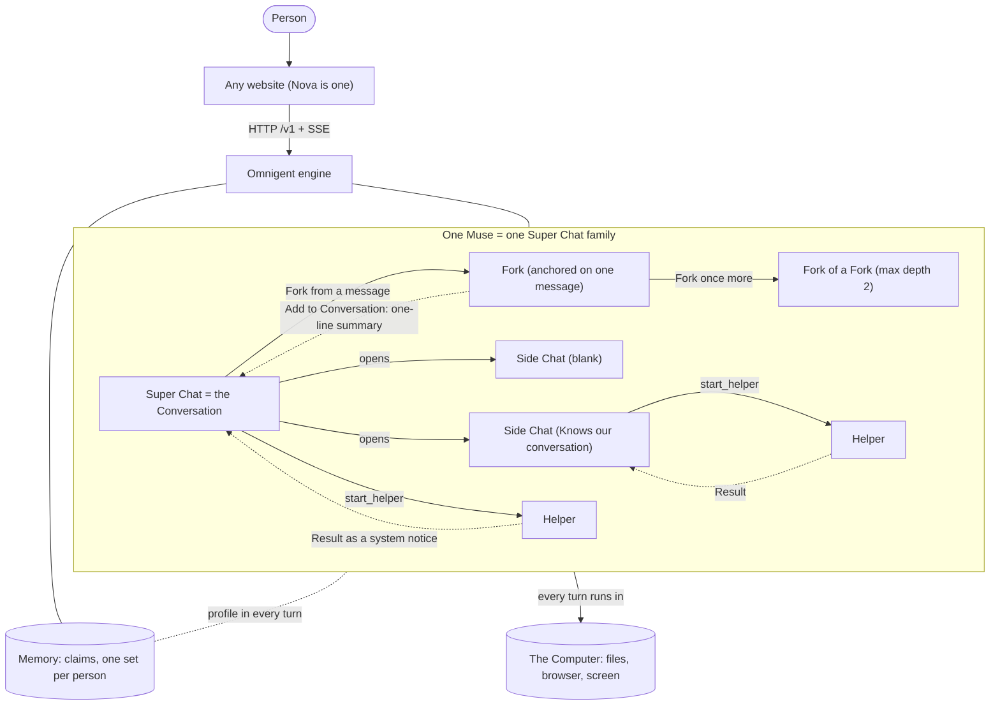

# How Nova's conversation works: Super Chat, Side Chats, Forks, Helpers

This guide is for two readers:

- a **developer** wiring a website to the engine,
- a **product person** who wants to know what the Muse can and cannot do.

Names: the product is **Nova**. The engine is **Omnigent**, vendored at `engine/omnigent`
(Python package `engine/omnigent/omnigent`). All paths below are relative to the repo root. Route
paths start with `/v1`.

Related pages: [WIRING.md](WIRING.md) (screen to engine call), [RUNNERS.md](RUNNERS.md) (where turns
run, how runners get keys), [ENGINE-TRIM.md](ENGINE-TRIM.md) (engine code we may drop). The glossary
is [CONTEXT.md](../../CONTEXT.md). Engine-side design notes live in `engine/omnigent/rollover/`.
Delegation, Activity masking, session labels and failure modes: [delegation-and-activity.md](delegation-and-activity.md).
What the model sees on each turn (instructions, history, Rollover, per-turn blocks, memory): [context-assembly.md](context-assembly.md).

## Contents

1. [The big picture](#1-the-big-picture)
2. [Super Chat (the Conversation)](#2-super-chat-the-conversation)
3. [Side Chat](#3-side-chat)
4. [Fork](#4-fork)
5. [Helpers and Activity](#5-helpers-and-activity)
6. [Memory](#6-memory)
7. [The Computer](#7-the-computer)
8. [Archiving](#8-archiving)
9. [Errors and notices](#9-errors-and-notices)
10. [API quick reference](#10-api-quick-reference)
11. [Settings](#11-settings)
12. [Glossary and ADRs](#12-glossary-and-adrs)

## 1. The big picture

One person has **one Muse**. The Muse has **one Super Chat** (the **Conversation**) and **one
Computer**. Everything else hangs off the Conversation.

- A **Side Chat** is a separate, full-size chat for one topic.
- A **Fork** is a Side Chat that started from one message of the Conversation.
- A **Helper** is a background worker the Muse starts for one task.
- An **Activity** is how any multi-step work shows up in a list.

The engine is the whole backend ([ADR 0009](../adr/0009-the-engine-is-the-whole-backend.md)). Any
website can talk to it and get the full product. Nova's API only checks who is asking and passes
calls through. Nova keeps presentation: layout, wording, translation. The engine returns **codes and
data**, never English copy (model-written titles are the exception).

Where each concept lives in the engine:

| Concept | Engine code |
|---|---|
| Find or create the Muse | `engine/omnigent/omnigent/superchat/muse.py` |
| Rollover | `engine/omnigent/omnigent/superchat/rollover.py`, `engine/omnigent/omnigent/context/rollover.py` |
| Transcript | `engine/omnigent/omnigent/superchat/transcript/` |
| Family event stream | `engine/omnigent/omnigent/superchat/family/` |
| Side Chats and Forks | `engine/omnigent/omnigent/superchat/side_chats/` |
| Helpers | `engine/omnigent/omnigent/superchat/helpers/`, `engine/omnigent/omnigent/superchat/subagents.py` |
| Activity | `engine/omnigent/omnigent/superchat/activity/` |
| Memory | `engine/omnigent/omnigent/memory/`, `engine/omnigent/omnigent/superchat/memory/` |
| The Computer | `engine/omnigent/omnigent/superchat/computer/`, `engine/omnigent/omnigent/onboarding/sandboxes/computer.py` |

Each of these is a "feature" registered once in `engine/omnigent/omnigent/superchat/features.py`.

The model loop runs on the **Claude SDK** harness by default, or on **Pi** (engine setting
`OMNIGENT_SUPERCHAT_DEFAULT_AGENT=nova-pi`, which also runs non-Claude models through OpenRouter; see
[../pi_futur_work.md](../pi_futur_work.md)). The harness only runs the loop. Every capability
(Helpers, memory, side chats, activity) is an Omnigent feature, never a harness feature.

## 2. Super Chat (the Conversation)

**What it is.** The one long-running chat between a person and their Muse. In the engine it is a
session with the label `omnigent.context.mode=superside-chat` and without the Side Chat label or
the Helper label (`is_super_chat` in `engine/omnigent/omnigent/superchat/feature.py`). Side Chats,
Forks and Helpers carry the same mode label, which is how they get the same tools.

### How `GET /v1/me/muse` finds or creates it

Code: `engine/omnigent/omnigent/superchat/muse.py`.

1. The engine builds a **key** from the person and the tenant (space): a SHA-256 of
   `("omnigent-muse-v1", tenant, user)`, cut to 32 hex characters (`muse_key`). The same person in
   the same tenant always gets the same key.
2. **Find.** It looks for a session labelled `omnigent.superchat.muse.key=<key>` and
   `omnigent.superchat.muse=true`, owned by the caller, newest first. Rows that carry the Side Chat
   label are skipped. If none is found, it also reads the session whose **id equals the key**
   (a Muse created a moment ago whose owner grant has not landed yet).
3. **Create.** Otherwise it creates a session whose id is the key. So two first calls at the same
   time hit the same primary key and end up with one row. The new session gets the labels
   `omnigent.context.mode=superside-chat`, `omnigent.superchat.muse=true`,
   `omnigent.superchat.muse.key=<key>`, `omnigent.computer.owner=<key>` and, if there is a tenant,
   `omnigent.tenant`. The Computer is keyed by that opaque key, not by the person's email.
4. The agent it runs on is server config: `OMNIGENT_SUPERCHAT_DEFAULT_AGENT` (for example
   `nova-claude` or `nova-pi`). Without it, and with no Muse yet, the route answers 503
   `superchat_not_configured`.
   `OMNIGENT_SUPERCHAT_SANDBOX_PROVIDER` (for example `computer`) launches the Muse on a managed
   Computer.

The answer is `{session_id, agent, created}`.

Other Muse routes:

- `PUT /v1/me/muse` `{agent}` switches the Muse to another built-in agent (409 while a turn runs).
- `POST /v1/me/muse/adopt` `{session_id}` claims an existing Super Chat the caller owns, so it is
  kept. It labels it with the Muse key and leaves every other label alone. Errors:
  `not_a_super_chat` (422, for a side chat, Helper or plain session), `muse_already_set` (409),
  `muse_tenant_mismatch` (409).

**Forks and Side Chats never carry the Muse labels.** When a session is forked, the store drops
`omnigent.superchat.muse` and `omnigent.superchat.muse.key` (`_MUSE_LABEL_KEYS` in
`engine/omnigent/omnigent/stores/conversation_store/__init__.py`, applied in the fork path of
`.../sqlalchemy_store.py`). A blank Side Chat is created with a fixed set of labels and never has
them. The lookup also skips any session with the Side Chat label, for copies made before the labels
were dropped. This is why a fork can never be returned as "my Conversation".

### Rollover: the Conversation never fills up

When the Conversation gets long, the engine writes a summary of the older part and keeps the
recent turns word for word. This is a **Rollover**. The summary is stored as a `compaction` item.
The full history stays stored: the Muse reads it with its `session_history` tool, and the person
still sees every message.

Two triggers (`engine/omnigent/omnigent/superchat/rollover.py`):

- **Size.** After a turn, if the reported context size reaches the threshold. The threshold is 60%
  of the model's window, capped at 200,000 tokens and never below 100,000
  (`resolve_rollover_threshold` in `engine/omnigent/omnigent/context/rollover.py`).
- **Idle.** The first message after a quiet period (default 12 hours,
  `OMNIGENT_ROLLOVER_IDLE_REFRESH_SECONDS`). This one runs before the turn, on purpose, so stale
  context is refreshed first.

**Rollover is non-blocking.** The size-triggered summary runs in the background. The next message
does not wait for it, because the threshold sits below the model's window and one more turn fits.
The next turn waits (at most 60 seconds) only if the context is at or past **95% of the window**
(`HARD_CONTEXT_WINDOW_FRACTION`). Only one rollover runs per session at a time. A turn that runs
while the summary is being written is not lost: both readers split the record at the latest
checkpoint with `split_at_latest_compaction`. Details:
`engine/omnigent/rollover/NON-BLOCKING-ROLLOVER.md`.

After each rollover, memory Upkeep is scheduled for the owner (see [Memory](#6-memory)).

**Clear conversation.** `POST /v1/sessions/{id}/reset` (owner only, Super Chat only, 409 while a turn
runs) is a rollover with no summary: the Muse starts fresh. Memory, files, Side Chats, Helpers and
Goals stay, and the old items stay stored. The transcript then starts at the reset, and
`?before_reset=true` pages the history before it
(`engine/omnigent/omnigent/superchat/transcript/reset.py`).

### Transcript API

`GET /v1/sessions/{id}/transcript` (`engine/omnigent/omnigent/superchat/transcript/routes.py`)
returns a chat as **typed blocks**. It works for the Conversation, a Side Chat, a Fork and a Helper.

- Query: `limit` (1 to 200, default 50), `before` (cursor), `include_seed`, `before_reset`.
- Response: `{data, has_more, older_cursor, lineage, reset, live}`.
- `data` is a list of messages `{id, role, created_at, blocks, forks}`. Block types:
  `text`, `card`, `helper`, `file`, `secure_entry`, `error`
  (`engine/omnigent/omnigent/superchat/transcript/blocks.py`).
- The engine does the work a client would otherwise copy: one block per `call_id`, system notices
  and hidden context dropped, a failed card or file call shows nothing, a running card is
  `pending`, a `start_helper` call becomes a `helper` block under the next assistant message, and an
  `error` item becomes an `error` block with a **code** (never text).
- A Side Chat's copied context is cut unless `include_seed=true`.
- `lineage` tells a client what kind of session it holds: `{kind: super | side | helper, root_id,
  parent_id, seed_item_id, anchor_item_id}`
  (`engine/omnigent/omnigent/superchat/lineage.py`). The session snapshot has the same data in a
  `superchat` block.
- `live` is true while a turn is in flight.
- Every string is redacted of the secrets the engine knows.

### Messages sent while the Muse works (steering)

A message that arrives while a turn runs is handed to the harness's own steer, so the model reads it
at its next step; when it cannot be, it runs as the next turn. The runner alone owns the waiting
messages, so nothing is lost and nothing is answered twice.

| Harness | How a steer reaches the turn | Taken when | When it cannot |
|---|---|---|---|
| `claude-sdk` | Written to the live CLI's stdin at priority `next` (`inner/claude_sdk_executor.py`); the CLI attaches it at the next tool boundary, or runs it as its own next turn if it missed this one | The CLI echoes our uuid (`--replay-user-messages`); the stream reads on until it does or ends | Runs as the next turn |
| `pi` | RPC `steer` while the agent loop runs | Pi emits it as a user `message_start`; at `agent_end`, `clear_queue` takes back what Pi never delivered | Runs as the next turn |
| native terminals (`claude-native`, `pi-native`) | The terminal's own input queue; Nova does not use them | n/a | n/a |

The runner keeps its copy of a message until the harness says the running turn took it
(`injection.consumed`); anything refused, or never reported when the turn ends, runs as the next turn.
Only plain text is steered; a message with an image or an attached file (a reference line) runs whole
as a turn of its own, one at a time, so the Computer's framed file text (`Feature.message_prefix`) is
put in front of it like any turn's message. A stop
or a delete cancels the messages waiting behind the turn. The session reports `idle` only once none
waits, and its `session.status` edges carry the runner's turn number, which `POST /events` also answers
(`turn`) for the turn a message started or joined. A `session.input.delivery` ping (`{item_id}`)
says a message started or stopped waiting; the transcript marks a waiting message
`delivered: "queued"` from the runner's live queue (`GET /v1/sessions/{id}/buffered` on the runner),
with nothing stored. Which features need a message to start its own turn is a Feature hook
(`needs_own_turn`; the knowledge feature answers for attached files).

Nova's worker (`packages/adapters/src/omnigent/gateway.ts`) waits for the stream's ready heartbeat, posts
the turn, and posts each message the person sends as the thread's own event signal (Postgres
`LISTEN/NOTIFY`) announces it; once the engine has it, its steering row is deleted (a failed post
releases it for the continuation). The run ends at an `idle` edge for the latest turn its messages
started or joined. There is no fixed deadline: after a quiet spell the worker asks the engine's
snapshot, follows a turn that is running or waiting (on helpers or the person) and renews the run's
lease, ends on `idle`, and fails with an honest line on `failed` or when the engine cannot be asked. A
dropped stream is reopened and asked the same way; an engine that does not come back fails the run in
about half a minute. A stop in Nova interrupts the engine's turn.

Known gap: if the stream drops and the reopened engine reads `idle` before its recovery turn has
started (the turn the runner starts for a message left unanswered by a restart), the run ends there
and Working stops early. The recovery turn still answers, and its reply lands in the transcript.

For a Helper that is already working, the Muse uses `message_helper`, which posts with `if_running`: the
Helper takes it into its running turn, or, if that turn has ended by then, refuses it (409
`not_running`) and nothing is kept, so a note never starts a second task. The Helper's single result
still arrives in the inbox.

### Family SSE stream

`GET /v1/sessions/{id}/family/stream` is **one** stream for a Conversation, its Side Chats, Forks and
Helpers. `{id}` may be a Super Chat or one of its Side Chats (resolved to the root).
Code: `engine/omnigent/omnigent/superchat/family/stream.py`.

Events carry **ids only**. The client refetches what changed.

| Event | Payload | Meaning |
|---|---|---|
| `message.done` | `chat_id`, `item_id` | An assistant message was stored in a family chat |
| `message.delivery` | `chat_id`, `item_id` | A message sent during a turn started or stopped waiting behind it |
| `turn.done` | `chat_id`, `status` | A turn ended (`completed`, `failed`, `incomplete`, `cancelled`) |
| `chat.reset` | `chat_id`, `item_id` | The chat was cleared |
| `chats.changed` | `root_id` | A Side Chat or Fork was opened, renamed or archived, or a Helper started |
| `activities.changed` | `root_id` | The Activity list may have changed |
| `session.heartbeat` | none | Sent after about 15 seconds of quiet |

A new subscriber gets `chats.changed` first. A heartbeat also re-reads the chat list and sends
`chats.changed` if a title or an archived flag changed.

There is also `GET /v1/sessions/{id}/activities/stream`, which carries only the Activity signals.

## 3. Side Chat

**What it is.** A separate, full-size chat the person (or the Muse, when asked) opens from the
Conversation for one focused topic. It sends nothing back. It cannot open another Side Chat (a
Fork is the one exception, see below). Code: `engine/omnigent/omnigent/superchat/side_chats/`.

**Who can open one.** Only the Super Chat itself. `refuse_side_chat_open` refuses a Side Chat, a
Helper, and any session not in superside-chat mode (403).

**Two ways to start**, chosen once:

| `start` | Name in the UI | The new chat begins with |
|---|---|---|
| `with_context` | "Knows our conversation" | A model-written summary of the Conversation plus its recent turns, and the Memory Profile |
| `blank` | "Started blank" | Only the Memory Profile |

### How a Side Chat is made

Route: `POST /v1/sessions/{id}/side_chats` with `{start, title?, first_message?, anchor_item_id?}`
(`engine/omnigent/omnigent/superchat/side_chats/routes.py`). The Muse's `side_chat_open` tool calls
the same route, so the app and the model share one implementation.

- **`with_context`** forks the Conversation with `side_chat: true`. The fork copies the record, then
  a **seed** is written afterwards in the background: the parent's latest summary (or a new one
  built over the whole record if it never rolled over) plus the recent whole turns
  (`_seed_rollover_side_chat` in `engine/omnigent/omnigent/server/routes/sessions/routes_core.py`,
  `build_side_chat_seed` in `engine/omnigent/omnigent/context/rollover.py`). The seed is framed so
  the new chat does not think it IS the main Conversation. Building it can take tens of seconds
  (limit 120 s, `SIDE_CHAT_SEED_TIMEOUT_S`). If it fails, the chat keeps the copied history.
- **`blank`** creates a fresh top-level session on the same agent, with no copied transcript.
- Both are stamped with `omnigent.side_chat=1`, `omnigent.side_chat.start=<start>` and
  `omnigent.side_chat.parent_id=<Super Chat id>`, and bound to the Super Chat's host and workspace
  (best effort), so they run on the same Computer.
- The family gets `chats.changed`.

Response: `{conversation_id, title, start, first_message_error, first_message_error_code,
anchor_item_id, parent_id}`.

### First message delivery

If `first_message` is given:

- For `with_context`, the seed is still being written, so the route answers **at once** and sends
  the message in the background once the seed lands. A message sent to a chat whose seed is pending
  waits for it (`engine/omnigent/omnigent/context/side_chat_seeds.py`). So the seed always comes
  before the chat's first own message.
- For `blank`, it is sent before the route answers.
- A failed send is retried **once** after 1.5 seconds when the failure looks temporary (409, 429,
  500, 502, 503, 504), unless the message is already stored (to avoid posting it twice). If it
  still fails, the chat exists anyway and the response carries `first_message_error` and
  `first_message_error_code`. The client should show a "didn't send" state and let the person
  resend. The client should not create the chat again.

### Titles

- An untitled chat gets a **quick title** from the first message right away (a short cut of the
  text).
- Once the message is delivered, a **model-written title** replaces it in the background
  (`engine/omnigent/omnigent/server/background_session_titles.py`). A client can turn this off per
  browser with the request header `x-omnigent-background-session-titles: off`.
- If the runner is **not ready** (HTTP 502, 503 or 504 from the runner), the title job retries after
  5, 20 and 50 seconds (about 75 seconds in all), then gives up and keeps the quick title.
- A rename sends `chats.changed`.

### Reading and unread

- `GET /v1/sessions/{id}/related_chats` lists the Side Chats and Forks of a session (up to
  200, `RELATED_CHATS_MAX` in `engine/omnigent/omnigent/context/rollover.py`; newest updated first; a
  Side Chat also gets its parent, on top of that cap). Each row has `id`, `title`, `start`,
  `summary` and `summary_body` (the seed summary of a `with_context` chat, for the "Started with
  context" header), `archived`, `live`, `unread`, `last_read_at`, `last_message_preview`, and the
  fork fields in the next section.
  Code: `list_related_chats` in `engine/omnigent/omnigent/context/rollover.py`.
- `GET /v1/sessions/{id}/context_summary` returns the latest Rollover checkpoint of a session
  (`summary`, `summary_body`, `created_at`, or all `null`). This is the "Knows our conversation" hover.
- **Unread.** A chat is unread for a person if they flagged it unread, or if its newest assistant
  reply is newer than the last time they read it (never read: newer than the chat itself). No write
  is needed on the reply path. `POST /v1/sessions/{id}/read` with `{item_id?}` clears it (the
  baseline never moves back) and sends `chats.changed`
  (`engine/omnigent/omnigent/superchat/family/unread.py`). Read state is kept in memory, per
  workspace, and **resets when the server restarts**.
- **Live flag.** `live` is true while a turn is running in that chat. It is on the transcript
  response, on `related_chats` rows and on each fork under a message.
- The Muse can read its Side Chats with `session_history` (`list_chats`, `read`, `search`).
  Read-only. A Side Chat can read its parent the same way.
- `GET /v1/sessions/{id}/items/search?query=...&scope=family` searches the Conversation and its
  Side Chats (`engine/omnigent/omnigent/superchat/family/search.py`).

## 4. Fork

**What it is.** A Fork is a Side Chat that records its **anchor**: the Conversation message it
started from. People use it to ask about one message without derailing the Conversation, like a
reply in a messaging app
([ADR 0010](../adr/0010-a-fork-is-a-side-chat-with-an-anchor.md)). It is not a new chat kind. It is
an ordinary `with_context` Side Chat with two more labels. Code:
`engine/omnigent/omnigent/superchat/side_chats/forks.py`.

### Labels

| Label | Meaning |
|---|---|
| `omnigent.side_chat.anchor_item_id` | The message it started from (an item id of the parent chat) |
| `omnigent.side_chat.fork_parent_id` | The chat holding that anchor: the Super Chat, or the Fork it was forked from |
| `omnigent.side_chat.copied_until_item_id` | Where the copied context ends. Everything up to this item is not the Fork's own |
| `omnigent.side_chat.parent_id` | Always the Super Chat (same as any Side Chat) |
| `omnigent.side_chat.fork_summary`, `...fork_summary_item_id` | Set by "Add to Conversation" (below) |

### What context it copies

**Up to the anchor only.** `POST /v1/sessions/{id}/side_chats` with `anchor_item_id` (and
`start: "with_context"`):

- The store copies items only up to and including the anchor item, by position. Later items of the
  same turn, errors and notices are not copied (`up_to_item_id` in the fork path of
  `routes_core.py` and `.../sqlalchemy_store.py`).
- The background seed is built from a record that ends at the anchor
  (`anchor_item_id` in `build_side_chat_seed`).
- So the Fork knows nothing the Conversation said after that message.

Rules (`check_fork_open`): the chat you fork from must be the Super Chat or a Fork of it. The anchor
must be a visible user or assistant message of that chat (in a Fork: one of its own messages, not
its copied context). Errors: 403 `forbidden`, 422 `fork_anchor_invalid`, 422 `fork_too_deep`.
A Fork can be forked **once more**. Deeper than that, the client starts a plain Side Chat.

A Fork's `anchor_item_id` and `parent_id` come back in the open response. A fork of a fork copies the
labels of the Fork it came from, except the "added" labels, which are removed.

### Forks in the transcript

In `GET /v1/sessions/{id}/transcript`, each message has `forks: []`. Each entry is
`{session_id, title, replies, live, unread, state, summary, created_at}`.

- `state` is `open`, `added` (a summary was added to the Conversation) or `archived`.
- `replies` counts the Fork's own visible messages (not its copied context), capped by scanning its
  newest 100 messages.
- An added Fork also adds a `fork_summary` block under its anchor message:
  `{type: "fork_summary", fork_id, anchor_item_id, title, summary}`.
- Forks anchored before a reset show only on `before_reset` pages.
- `related_chats` rows for a Fork also carry `anchor_item_id`, `fork_state`, `fork_summary`,
  `fork_parent_id`, `anchor_snippet` (the first ~120 characters of the anchor message),
  `fork_count` and `replies`.

### Add to Conversation

`POST /v1/sessions/{fork_id}/add_to_conversation` with optional `{summary}` (up to 500 characters).

- Without a summary, the engine writes a one-line summary (at most 16 words) from the Fork's own
  recent messages, using the title model. If that is not available it falls back to the first
  sentence of the Fork's last reply. If the Fork has nothing of its own yet, the route answers 400
  `invalid_input`.
- It stores the summary on the Fork (its `state` becomes `added`) and appends a **system notice** to
  the chat holding the anchor: `[System: added from a fork (a side chat on an earlier message)
  about "<title>": 
]`. The Muse reads this in its context. The transcript hides system
  notices and draws the `fork_summary` block instead.
- Asking again with the same summary changes nothing. A new summary adds a new notice, so the Muse
  reads the latest.
- If the parent chat is idle, the runner drops its warm history so the next turn reloads it with the
  notice. If a turn is running, the notice is read at the next cold start.
- Response: `{fork_id, session_id (the chat holding the anchor), anchor_item_id, item_id, title,
  summary, state}`. Errors: 422 `not_a_fork`, 403 without edit access to the Fork and its parent.

### Open as side chat, Archive

- **Open as side chat** has no engine call. A Fork already is a Side Chat, so the client just opens
  it in the Side Chat list (Nova: `onOpenSideChat` in
  `apps/web/src/features/side-chats/ForkThread.tsx`).
- **Archive** is the normal Side Chat archive (see [Archiving](#8-archiving)). An archived Fork has
  `state: archived`.

### Forks are not the Conversation

Forks never carry the Muse labels, as described in [section 2](#2-super-chat-the-conversation), and
`GET /v1/me/muse` skips every Side Chat. The normal session list also hides every session with the
Side Chat label.

### Super Chat vs Side Chat vs Fork vs Helper

| | Super Chat (Conversation) | Side Chat | Fork | Helper |
|---|---|---|---|---|
| Who starts it | Made once per person by `GET /v1/me/muse` | The person ("+ New side chat"), or the Muse when asked (`side_chat_open`) | The person, from one message | The Muse (or a worker Helper), with `start_helper` |
| Context it sees | Its own full history, rolled over into summaries | `with_context`: summary of the Conversation plus recent turns. `blank`: nothing. Both get the Memory Profile | Conversation **up to the anchor message** (summary plus recent turns), plus the Memory Profile | The Brief the Muse wrote plus the Memory Profile. Can look up exact earlier messages with `session_history` |
| Where it shows | The main chat | Sidebar list | Under its anchor message, and in the sidebar and the All forks list | Activity list; opened read-only |
| Can the person write in it | Yes | Yes | Yes | No. Only the chat that launched it can stop it |
| Can it write back | n/a | No. The Muse can read it | Only through "Add to Conversation": a one-line summary the person asks for | Yes: its final message (the **Result**) goes back to the chat that started it |
| Lifetime | Forever. Rolls over, never archived | Until archived. Reopens if a message is written to it | Same as a Side Chat | Ends when its work is done |

## 5. Helpers and Activity

### Starting a Helper

A Helper is a short-lived worker the Muse starts for one task while the conversation goes on. In the
engine it is a **sub-agent** session (CONTEXT.md: "In the engine it is a Sub-agent").

- The Muse calls the `start_helper` tool
  (`engine/omnigent/omnigent/superchat/helpers/tools.py`). Arguments: `task` (the whole brief; the
  Helper does not see the conversation), `model` (`fast` or `strong`, default `strong`), `reasoning`
  (optional), `files` (optional uploaded file ids). It can be called several times in one step to
  run Helpers in parallel. A repeat of the same task from the same chat within 10 seconds is
  treated as the same hand-off (`DEDUP_WINDOW_S` in
  `engine/omnigent/omnigent/superchat/helpers/handlers.py`).
- The tool is offered only where a Helper type is declared in the agent bundle. In Nova the
  type is `worker`, which can start `subworker` parts (`infra/omnigent/templates/agents/worker/config.yaml`).
  A `subworker` cannot start more. The nesting cap is: chat, Helper, one level of parts
  (`refuse_subagent_nesting` in `engine/omnigent/omnigent/superchat/subagents.py`).
- `fast` and `strong` are mapped to real models by engine config (`OMNIGENT_HELPER_MODEL_FAST`,
  `OMNIGENT_HELPER_MODEL_STRONG`, and `..._PI` variants for Pi). A choice with no model configured
  uses the parent's model. The Muse never names a model id.
- **Concurrency.** At most 10 live Helpers per chat tree by default
  (`OMNIGENT_SUBAGENT_MAX_CONCURRENT`), plus each type's own `max_sessions`.
- **What a Helper starts with.** Its Brief with the Memory Profile put in front
  (`prepend_memory_profile`, called from `engine/omnigent/omnigent/runner/tool_dispatch.py`), only
  when a new Helper is created. See the note on conversation summaries in the last section of this
  page.
- **Quiet background Helpers** (the daily Study, quiet-moment notes) run as scheduled or ad-hoc
  Helpers on the fast model. A quiet-moment Helper's Result never wakes the Conversation.

### The wake path: how the Result gets back

1. The Helper finishes. The runner posts a **system notice** to the chat that launched it (the
   Originating Chat): a message on `POST /v1/sessions/{id}/events` with `is_system_notice: true`,
   containing the Helper's final message (first 4,000 characters; for more, the Muse is pointed at
   the Helper's history) and the names of files it saved
   (`format_subagent_wake_notice_with_result`; `_deliver_subagent_wake_post` in
   `engine/omnigent/omnigent/runner/app.py`).
2. That message starts a Muse turn, so the Muse can tell the person without the person writing
   anything. This is "the Muse speaks first". The notice instructs the Muse to deliver the finished
   thing, not a status update.
3. The post is retried a few times on temporary failures. If it still fails, the Result stays in the
   parent's inbox and the wake is retried after the next reconnect or turn.
4. If the Originating Chat is an **archived** Side Chat, the Result goes to the Super Chat instead,
   with a note saying so (`resolve_wake_target`).
5. The transcript hides system notices. A `start_helper` call shows as a `helper` block with the
   Helper's `session_id`, `title` and `status` (`in_progress`, `done`, `failed`, `cancelled`,
   or `unknown`).

A Helper is visible and **read-only**: the person can open it and read every step but cannot write
to it. Only its Originating Chat can cancel it, and only when the person asks.

### Activity

An **Activity** is one piece of multi-step work. It is **never stored**: the engine derives it on
read from conversations and items (`engine/omnigent/omnigent/superchat/activity/derive.py`).

- One Activity is either a **chat turn** (Conversation, Side Chat or Fork) or a **whole Helper
  task**.
- A chat turn is shown only when it did real work: at least 3 steps, or at least one work tool
  (search, page read, file, browser), or it ran longer than 60 seconds.
  This is narrower than the glossary line "a turn that used tools".
- Fields: a title (what was asked), a one-line outcome, a `status` (`in_progress`, `done`,
  `failed`, `cancelled`), a time, a `source` (`turn`, `side_chat`, `background`, `scheduled`,
  `goal`, `housekeeping`) and plain-language **steps** with their tool name.
- Titles are tidied from the request or written by the model in the background (a read starts at
  most 8 title jobs, newest first).
- Quiet upkeep (daily note, Dreaming, People) is folded into one "housekeeping" row per local day.
- A Helper's status: `failed` if the runtime says so, `in_progress` while running or waiting, a
  Helper marked as launching with no status yet is `in_progress` (or `failed` after 5 minutes), a
  closed Helper that never reported is `cancelled`, otherwise `done`.

Routes: `GET /v1/sessions/{id}/activities` (`limit` 1 to 100, `before`, `tz` for day grouping),
`GET /v1/sessions/{id}/activities/{activity_id}` (full steps), and the stream above. `{id}` is the
Super Chat or one of its Side Chats. Registered in
`engine/omnigent/omnigent/server/routes/sessions/routes_items.py`.

**Registering a tool in the Activity panel (Nova).** A step never shows the tool's raw name, only an
icon, a plain title and (when useful) a short snippet. All three come from one registry,
`TOOL_PRESENTATION` in `packages/core/src/tool-presentation.ts`. When a tool is added to the agent
bundle (`infra/omnigent/agents/nova-claude/`) or to the engine's always-on tools
(`ALWAYS_ON_SUPERSIDE_CHAT_TOOLS`), add an entry there with an icon (`ToolIconKey`), a
`title(args)` derived only from the call's arguments, and a `snippet(output)`, or
`tool-presentation.completeness.test.ts` fails. Map any new icon key in
`apps/web/src/pages/muse/chrome/toolIcons.ts`.

### Asks

An **Ask** is anything the Muse is waiting on the person for. Open Asks are listed by
`GET /v1/me/asks` and answered with `POST /v1/me/asks/{ask_id}/answer`
(`engine/omnigent/omnigent/superchat/approvals/`). Approvals have their own routes under
`/v1/me/approvals/` (see the table in section 10).

## 6. Memory

The Muse remembers lasting facts about the person. Memory belongs to the **person**, not to a chat:
the Conversation, every Side Chat, every Fork and every Helper read and write the same set. The
user is always resolved from the **owner of the calling session** on the server, never from tool
arguments (`resolve_memory_user` in
`engine/omnigent/omnigent/superchat/memory/tools.py`; `_resolve_user` in
`engine/omnigent/omnigent/server/routes/session_memory.py`). A session merely shared with someone
never exposes the owner's memory, even at edit level.

### What is stored

A **claim** is one sentence about the person, plus where it came from. Table `memory_claims`
(`engine/omnigent/omnigent/db/db_models.py`, store in
`engine/omnigent/omnigent/stores/memory_store/`).

| Field | Meaning |
|---|---|
| `kind` | `preference`, `instruction`, `fact`, `decision`, `person`, `project`, `working_style`, `commitment` |
| `claim_text` | One self-contained sentence |
| `quote`, `speaker` | The person's exact words it came from |
| `evidence` | Links to `{session_id, item_id}` |
| `explicitness` | `stated` (the person said it) or `inferred` (deduced from behaviour or a correction) |
| `confidence` | 0 to 1. Stated claims start at 0.9, inferred at 0.4 |
| `reinforcement_count`, `reinforced_at` | How often a near-duplicate confirmed it, and when last |
| `status` | `active`, `superseded`, `expired`, `forgotten` |
| `supersedes_claim_id` | The older claim this one replaced |
| `valid_until` | Optional end date (extracted from the text, for example "on leave until Nov 3"). Past it, the claim **reads as `expired`** (derived when read: `MemoryClaim.effective_status`): it leaves the profile at that moment and is skipped by search, can no longer be reinforced, edited or superseded, and stays in the Memory tab marked "Expired" so the person can forget it. |
| `person_authored` | True once the person edited it |
| `run_id` | The Upkeep run that wrote it (empty for a direct save) |

When shown to a client, each claim gets an `origin`: `edited` (the person's edit), `said` (stated),
or `noticed` (inferred). Search uses a rebuildable **hybrid index** (BM25 plus embeddings, txtai)
over active claims, kept in step on every write (`engine/omnigent/omnigent/memory/index.py`). The
table is the source of truth.

Memory needs the optional `memory` extra of the engine (`uv sync --extra memory`) and an embeddings
model key (`OMNIGENT_MEMORY_EMBEDDINGS_MODEL`, default `openai/text-embedding-3-small`).
Without the extra, `build_memory_service` returns nothing: the memory routes are not mounted, the
profile is empty, and the memory tools answer "long-term memory is not configured on this server".

### How the Muse writes memory

Two ways:

1. **Right away, by the model.** Every superside-chat session has five tools
   (`engine/omnigent/omnigent/superchat/memory/`): `memory_remember`, `memory_search`,
   `memory_get`, `memory_explain` and `memory_forget`.
   - `memory_remember` saves a claim and indexes it immediately. A near-duplicate (high hybrid score
     and high word overlap) is **reinforced** instead of added (confidence +0.05). A claim is only
     **superseded** when the model names the old one with `replaces_claim_id`. The old claim is kept
     as `superseded`. If the old claim is `person_authored`, it is kept and the new text is added
     beside it.
   - `memory_forget` is two steps: `confirm=false` returns a plan, `confirm=true` marks the claim
     `forgotten` and removes it from the index.
2. **In the background, by Upkeep.** A job reads what the person wrote recently and extracts claims.
   Code: `engine/omnigent/omnigent/memory/upkeep.py`, scheduling in
   `engine/omnigent/omnigent/server/memory_upkeep.py`. It runs
   - after every Rollover of a Super Chat family session, and
   - on an hourly sweep for every recently active owner
     (`OMNIGENT_UPKEEP_SWEEP_INTERVAL_SECONDS`), at most 4 owners at a time
     (`OMNIGENT_UPKEEP_MAX_CONCURRENCY`), at most one run per person.

   It needs the server's `llm:` config. Without one the run is recorded as skipped.

### Evidence rules (what Upkeep will and will not learn from)

These are enforced in code, not left to the model:

- **Window.** Only messages newer than the person's last successful run (a watermark). A session
  counts only if it is the person's own conversation: **Helper sessions, scheduled runs and
  sub-agent dispatches are never evidence** (`_is_person_session`). Runtime **system notices** (such
  as a Helper Result or an added-fork summary) are skipped.
- **Only the person's words are evidence.** Assistant text is shown for context only. Every
  candidate must cite a user message item.
- **Gate.** Fewer than 3 substantive new user messages: the run is skipped and the watermark does not
  move.
- **Verification** (`verify_candidate`): the claim and quote must be at most 500 characters, the kind
  and explicitness valid, the cited item must be in the window, the **quote must appear verbatim** in
  that message, and text that looks like a secret (passwords, tokens, keys, account numbers) or a
  one-time request is rejected.
- **Apply.** A new claim is inserted. If similar claims exist, one classification call says `same`
  (reinforce: +0.05 stated, +0.2 inferred), `new`, or `contradicts` (supersede, only if the model
  names which claim; otherwise rejected). An unparseable reply is rejected, never guessed.
- **Person edits win.** A `person_authored` claim is never overwritten: a replacement is added
  beside it.

So a claim is ranked by explicitness (stated starts high, inferred low), repetition (reinforcement
raises confidence) and recency (search adds a small boost that fades over about 90 days; focus
claims expire from the profile after 30 days).

### How memory gets into context

- **Per-turn Memory Profile.** Before every turn in a superside-chat session, the runner fetches the
  person's profile from `GET /v1/sessions/{id}/memory/profile` and puts it in front of the
  person's message (`engine/omnigent/omnigent/superchat/prompt_prefix.py`, called by
  `_apply_turn_prefix_blocks` in `engine/omnigent/omnigent/runner/app.py`). It is fetched fresh each
  turn because the SDK's system prompt is frozen per warm client. The block is wrapped:
  `[Standing memory about the user ... not a message from the user]` ... `[End of standing memory]`.
  The same prefix also carries the Projects list and a local-time line. Any failure means "no
  profile", never a failed turn.
- **What the profile contains** (`MemoryService.profile`): active claims of kinds `preference`,
  `instruction`, `working_style`, `fact`, `commitment`, `project`, `decision`, grouped under
  Preferences, Standing instructions, Working style, About the user, Commitments, Projects and
  Current focus; only claims with confidence **0.75 or more** (so a single inferred claim stays out
  until it has been confirmed twice); newest-reinforced first; `decision` claims that have not been
  reinforced for 30 days drop out; capped at about 6,000 characters (about 1,500 tokens); cached per
  person and re-rendered after any write and once a day. `person` claims are searchable but are not
  in the profile.
- **On demand.** The model searches with `memory_search` (limit up to 20), reads one with
  `memory_get`, and asks "why do you think that" with `memory_explain` (quote, sources, chain of
  superseded claims).
- **Helpers** get the profile put in front of their Brief when they are created.
- **Side Chats and Forks** get the same per-turn profile, because they are in superside-chat mode
  and belong to the same owner. A blank Side Chat starts with the profile and nothing else. Their
  messages also count as evidence for Upkeep (they are the person's own conversations; Upkeep
  skips only Helper and scheduled sessions). I did not trace how Upkeep treats a Fork's copied
  context.

### Editing and forgetting (the Memory tab)

All routes are under `/v1/sessions/{id}/memory/...` and need the caller to be the owner of the
session (`engine/omnigent/omnigent/server/routes/session_memory.py`):

- `GET .../memory/claims?kinds=a,b` lists active claims, newest first, including expired ones
  (`status: "expired"`; Nova shows them dimmed, marked Expired, with only Forget).
- `PATCH .../memory/claims/{claim_id}` `{text}` is the person's edit. The claim becomes
  `person_authored`, so background writers never overwrite it.
- `POST .../memory/forget` `{claim_id | query, confirm}` forgets one claim.
- `GET .../memory/claims/{claim_id}` and `.../explain`, `GET .../memory/search?query=&kind=&limit=`,
  `POST .../memory/remember`, `GET .../memory/profile`.

Nova relays these through its API (`apps/api/src/features/memory/router.ts`,
`packages/adapters/src/omnigent/memory.ts`) and redacts the profile, claims and notes before
showing them.

### Daily notes

Besides claims, the engine keeps one **daily note** per person per local day
(`engine/omnigent/omnigent/superchat/daily_notes/`). A person's edit to a section is protected;
background writers only append to it.

- `GET /v1/me/daily-notes?from&to&limit`, `GET /v1/me/daily-notes/{date}` (`today` works),
  `PUT /v1/me/daily-notes/{date}` (the person's edit).
- `POST /v1/daily-notes/write` is what a Helper's `daily_note_update` tool calls. It may write only
  today or, for the nightly Dreaming pass, yesterday.
- The **quiet-moment pass** keeps today's note and memory current: when the Conversation has been
  quiet for 20 minutes (`OMNIGENT_QUIET_MOMENT_IDLE_SECONDS`) after at least 3 user messages since
  the last pass, one bounded Helper updates the note and saves lasting facts with
  `memory_remember`. At most 4 passes a day per person. Nothing runs when proactivity is off or in
  quiet hours.

### Not part of Nova's memory

The engine also has generic `hindsight_*` tools (`engine/omnigent/omnigent/tools/builtins/hindsight.py`)
for an external memory service. They are not part of the Muse's memory described here, and I found
no use of them in the Nova agent bundles.

## 7. The Computer

The Computer is the Muse's own machine: its screen, files and browser. Each Muse has exactly one,
and every turn runs inside it (CONTEXT.md, [ADR 0004](../adr/0004-engine-owns-the-computer.md)).

- **One per person per space.** The engine's `computer` sandbox provider
  (`engine/omnigent/omnigent/onboarding/sandboxes/computer.py`) asks the supervisor for a container
  keyed by the session's `omnigent.computer.owner` label (the Muse key) and `omnigent.tenant`. The
  Muse's Side Chats, Forks and Helpers run on the same host.
- **The home directory persists.** The provider registers
  `workspace_survives_recreate=True` (`engine/omnigent/omnigent/onboarding/sandboxes/registry.py`).
  The Computer's home is a per-owner directory on the supervisor's disk
  (`<OMNIGENT_COMPUTER_HOME_ROOT>/homes/<key>`), so when the container is recreated, the files are
  still there. For a provider without this flag, a recreate stores an `info`-level `workspace_reset`
  notice in the chat (see [Errors and notices](#9-errors-and-notices)). Setup and the shared-path
  rule are in [RUNNERS.md](RUNNERS.md).
- **Screen routes** (`engine/omnigent/omnigent/superchat/computer/routes.py`):
  `GET /v1/sessions/{id}/computer` (`{available, in_control, ready}`),
  `POST .../computer/screen` `{interactive}` (a view URL, or a control token to **take over**),
  `POST .../computer/release` (hand back), `POST .../computer/recording` (`start` or `stop`, used
  to teach a Skill). Nova relays the screen stream through its same-origin proxy.
- **Files and artifacts.** The Muse saves deliverables with the `artifact_save` tool. The engine
  stores them (`/v1/artifacts`, `engine/omnigent/omnigent/superchat/artifacts/`): a name that exists
  gets a new version. Allowed kinds are `html`, `md`, `pdf`, `docx`, `xlsx`, `csv`, `pptx`, `png`,
  `jpg`, `txt`, `json`, up to 25 MB. HTML previews are served with a strict content security policy.
- **In the transcript.** An `artifact_save` call that succeeded becomes a `file` block
  (`artifact_id`, `name`, `mime`, `title`, `kind`, `size`, `version`, `versions`) in a message of
  its own. That is the **artifact card**. A `render_card` call becomes a `card` block, and a
  `vault_request_secret` call a `secure_entry` block. A Helper's saved files are named in its
  Result notice so the Muse can show them.

## 8. Archiving

An archived Side Chat or Fork is **hidden from the main list, never deleted**. It stays readable by
the person and by the Muse (`related_chats` still returns it with `archived: true`;
`list_related_chats` passes `include_archived=True`). `Archived` in CONTEXT.md.

### Manual archive (today)

- **How.** `PATCH /v1/sessions/{id}` with `{"archived": true}` (owner only). Nova calls it from
  `chats.archive` (`apps/api/src/features/side-chats/service.ts`, `archiveOmnigentSession` in
  `packages/adapters/src/omnigent/side-chats.ts`).
- **What happens.** The archived flag and an `omnigent.archived_at` label are set; the family gets
  `chats.changed`; the person's read state for that chat is dropped; and the runner is stopped after
  a delay (the delay leaves room for an Undo). An unarchive within that time cancels the stop
  (`engine/omnigent/omnigent/server/routes/sessions/routes_core.py`, `_spawn_archive_stop` in
  `.../_sessions/orchestration.py`).
- **Where it goes.** The Side Chat or Fork leaves the default list. `GET /v1/sessions` hides every
  Side Chat anyway; clients list them through `related_chats` and filter on `archived`. Nova shows
  them under an Archived fold.
- **How to restore.** `PATCH /v1/sessions/{id}` with `{"archived": false}` unarchives. Nova calls
  it from `chats.unarchive` (`unarchiveOmnigentSession` in the same adapter file) behind a
  **Restore** button: in the header of an archived Side Chat, in an archived Fork's thread, and on
  archived rows of the All forks list. A user **message** posted to an archived Side Chat also
  unarchives it (`maybe_unarchive_on_user_message` in
  `engine/omnigent/omnigent/superchat/side_chats/chats.py`, called from
  `engine/omnigent/omnigent/server/routes/sessions/routes_events.py`); either way the family gets
  `chats.changed`, so lists show it again at once.
- **Never archived:** the Super Chat and Helpers (only sessions with the Side Chat label are).
- **Results of an archived chat's Helpers** go to the Super Chat (see section 5).

### Auto-archive (setting)

Code: `engine/omnigent/omnigent/superchat/side_chats/archiving.py`.

- **One sweep for everyone** (`SideChatArchiveSweeper`), every hour by default
  (`OMNIGENT_SIDE_CHAT_ARCHIVE_SWEEP_INTERVAL_SECONDS`). For each Super Chat it takes that person's
  **effective age** and archives their Side Chats and Forks that are not archived, have no turn
  running or waiting, and whose last activity (`updated_at`, which moves with every new item) is
  older than that age. It finds them by the Side Chat parent label (and the older fork-source
  label), so legacy chats are covered too.
- **The effective age** is the person's own setting, or else the **deployment default**,
  `OMNIGENT_SIDE_CHAT_ARCHIVE_AFTER_SECONDS` (30 days unless set). A person can choose **never**.
- **Routes** (same auth and tenant rules as `/v1/me/muse`; stored per person in the engine's
  `preferences` table under the Muse key):

  | Call | Body / answer |
  |---|---|
  | `GET /v1/me/archiving` | `{"side_chat_auto_archive_days": 1 \| 7 \| 30 \| null, "default_days": 30}`: the effective value (`null` = never) and the deployment default in days |
  | `PUT /v1/me/archiving` | `{"side_chat_auto_archive_days": 1 \| 7 \| 30 \| null \| "default"}`: a choice, an explicit never, or `"default"` to forget the choice. Anything else is `400 invalid_input`. |

- **Same path as manual archive:** the flag and label, `chats.changed`, the read-state prune and the
  deferred runner stop. The Super Chat, Helpers and live chats are never touched.
- **In Nova:** Settings → "Archive side chats": Never, After a day, After a week, After a month.
  The current effective value is selected (the default when the person never chose).

## 9. Errors and notices

**Clients own the wording.** The engine returns stable codes (ADR 0009).

A failed turn is stored as an `error` item. The transcript shows it as an `error` block carrying one
of the **public error codes**, a closed set in
`engine/omnigent/omnigent/runtime/public_error_codes.py`. Old stored codes and exception names are
mapped into the set at read time (`public_error_code`); anything unknown becomes `internal`.

| Code | Meaning |
|---|---|
| `insufficient_credit` | The account behind the model has no credit or quota |
| `rate_limited` | The provider throttled the request; retry shortly |
| `overloaded` | The provider is at capacity |
| `auth_failed` | The provider rejected the credentials |
| `context_too_long` | The conversation no longer fits the model's window |
| `provider_unavailable` | Provider error, unreachable, or dropped connection |
| `timeout` | The turn or the provider call took too long |
| `sandbox_unavailable` | The Computer the turn runs in is gone |
| `workspace_reset` | **Not a failure.** The Computer was replaced and unsaved files are gone. The chat goes on |
| `internal` | Anything else: our bug or an unclassified failure |

**`workspace_reset` is info-level.** The engine stores it with `level: "info"` when it relaunches a
sandbox whose provider does not keep the workspace (`_note_workspace_reset_on_recreate` in
`engine/omnigent/omnigent/server/routes/_sessions/orchestration.py`). The transcript block is
`{type: "error", code: "workspace_reset", level: "info"}`. A client should draw it as a quiet note,
not as a failed reply. With the `computer` provider the home survives, so this notice should not
appear there. The old stored code `managed_sandbox_workspace_reset` maps to it.

Route errors use the engine's `ErrorCode` values (`engine/omnigent/omnigent/errors.py`). The ones
in this guide: `superchat_not_configured` (503), `not_a_super_chat` (422), `muse_already_set` (409),
`muse_tenant_mismatch` (409), `fork_anchor_invalid` (422), `fork_too_deep` (422), `not_a_fork` (422),
`invalid_input` (400/422), `forbidden` (403), `not_found` (404), `conflict` (409).

## 10. API quick reference

All paths are registered in the engine and start with `/v1`. `{id}` is a session id. Auth is the
engine's (Nova sends the person's email, a proxy secret, and a tenant header on every call).

| Method | Path | Purpose |
|---|---|---|
| GET | `/me/muse` | Find or create the caller's Super Chat |
| PUT | `/me/muse` | Switch the Super Chat to another built-in agent |
| POST | `/me/muse/adopt` | Claim an existing Super Chat |
| GET | `/sessions/{id}/transcript` | A chat as typed blocks, with `forks`, `lineage`, `reset`, `live` |
| GET | `/sessions/{id}/family/stream` | SSE for the Conversation, Side Chats, Forks and Helpers |
| POST | `/sessions/{id}/events` | Send a message (or other event) to a chat |
| POST | `/sessions/{id}/reset` | Clear the Conversation |
| GET | `/sessions/{id}/related_chats` | List Side Chats and Forks (with unread, live, summary) |
| POST | `/sessions/{id}/side_chats` | Open a Side Chat, or a Fork with `anchor_item_id` |
| POST | `/sessions/{id}/add_to_conversation` | Add a Fork's summary under its anchor |
| GET | `/sessions/{id}/context_summary` | Latest Rollover summary ("Knows our conversation") |
| POST | `/sessions/{id}/read` | Mark a chat read |
| PATCH | `/sessions/{id}` | Archive (`archived: true`), unarchive, rename |
| GET | `/sessions/{id}/items/search?scope=family` | Search the Conversation and its Side Chats |
| GET | `/sessions/{id}/activities` | Activity list (grouped by day with `tz`) |
| GET | `/sessions/{id}/activities/{activity_id}` | One Activity with steps |
| GET | `/sessions/{id}/activities/stream` | SSE of Activity changes |
| GET | `/sessions/{id}/memory/profile` | The delimited Memory Profile |
| GET | `/sessions/{id}/memory/claims` | List active claims |
| PATCH | `/sessions/{id}/memory/claims/{claim_id}` | Edit a claim (person-authored) |
| GET | `/sessions/{id}/memory/claims/{claim_id}/explain` | Evidence and chain of a claim |
| GET | `/sessions/{id}/memory/search` | Hybrid search over claims |
| POST | `/sessions/{id}/memory/remember` | Save a claim |
| POST | `/sessions/{id}/memory/forget` | Forget a claim (`confirm` to execute) |
| GET / PUT | `/me/daily-notes`, `/me/daily-notes/{date}` | List, read and edit daily notes |
| GET | `/sessions/{id}/computer` | Is there a screen, is a person in control, is the runner ready |
| POST | `/sessions/{id}/computer/screen` | View URL, or take over (`interactive: true`) |
| POST | `/sessions/{id}/computer/release` | Hand the screen back |
| POST | `/sessions/{id}/computer/recording` | Start or stop a teaching recording |
| POST / GET | `/artifacts`, `/artifacts/{id}`, `/artifacts/{id}/content` | Save and read deliverable files |
| GET | `/me/asks` | Open Asks |
| POST | `/me/asks/{ask_id}/answer` | Answer an Ask |
| GET | `/me/approvals/pending` | Pending approvals |
| POST | `/me/approvals/{elicitation_id}/answer` | Answer an approval |
| GET / PUT | `/me/archiving` | Per-person auto-archive setting (section 8) |

Other routes registered by the same features, not covered here: `/objectives` (Goals), `/me/feed`,
`/me/topics`, `/suggestions` (Ideas), `/taught-skills` (Skills), `/me/vault`, `/me/approval-rules`,
`/me/approval-settings`, `/cards/schemas`, `/me/proactivity`.

## 11. Settings

Engine-side:

| What | Setting | Default |
|---|---|---|
| Bundle a new Muse runs on | `OMNIGENT_SUPERCHAT_DEFAULT_AGENT` | none (required) |
| Launch each new Muse on a Computer | `OMNIGENT_SUPERCHAT_SANDBOX_PROVIDER=computer` | off |
| Refresh after quiet period | `OMNIGENT_ROLLOVER_IDLE_REFRESH_SECONDS` | 43200 (12 h); use 60 for testing |
| Archive idle side chats after (server-wide) | `OMNIGENT_SIDE_CHAT_ARCHIVE_AFTER_SECONDS` | 2592000 (30 days); use 60 to 3600 for testing |
| Archive sweep interval | `OMNIGENT_SIDE_CHAT_ARCHIVE_SWEEP_INTERVAL_SECONDS` | 300 |
| Daily Study per Conversation, plus quiet-moment notes | `OMNIGENT_PROACTIVE_PROVISION=1` | on in Nova |
| Quiet moment idle time | `OMNIGENT_QUIET_MOMENT_IDLE_SECONDS` | 1200 |
| Helpers at once | `OMNIGENT_SUBAGENT_MAX_CONCURRENT` plus each type's `max_sessions` | 10 |
| Upkeep model | server `--config` `llm:` block | required for Upkeep |
| Upkeep sweep interval, concurrency | `OMNIGENT_UPKEEP_SWEEP_INTERVAL_SECONDS`, `OMNIGENT_UPKEEP_MAX_CONCURRENCY` | 3600, 4 |
| Memory search | `OMNIGENT_MEMORY_EMBEDDINGS_MODEL` plus its provider key | `openai/text-embedding-3-small` |
| Web search | `TAVILY_API_KEY` on the host, plus `OMNIGENT_RUNNER_ENV_PASSTHROUGH=TAVILY_API_KEY` | required for `web_search` |

Nova's own side of the gateway (`packages/adapters/src/omnigent/env.ts`,
`omnigentSuperChatConfigFromEnv`):

| What | Setting | Default |
|---|---|---|
| Quiet check (not a deadline) | `OMNIGENT_TURN_TIMEOUT_MS` | 300000 (5 min) |
| Run lease duration | `OMNIGENT_LEASE_DURATION_MS` | 300000 (5 min) |
| `chats.messages` page size | `OMNIGENT_CHATS_PAGE_SIZE` | 50 |

## 12. Glossary and ADRs

- Glossary: [CONTEXT.md](../../CONTEXT.md). Use its words exactly: Muse, Conversation, Side chat,
  Fork, Helper, Activity, Ask, Archived, Computer. The engine words differ: Conversation is the
  **Super Chat**, a Helper is a **sub-agent**, and the Activity panel is the **Activity Feed**
  (engine glossary: `engine/omnigent/rollover/CONTEXT.md`). Nova's "Task" is a plan item of a Goal and is not a Helper.
- [ADR 0001](../adr/0001-one-muse-per-person.md): one Muse per person.
- [ADR 0004](../adr/0004-engine-owns-the-computer.md): the engine owns the Computer.
- [ADR 0007](../adr/0007-the-muse-delegates-multi-step-work.md): the Muse delegates multi-step work.
- [ADR 0009](../adr/0009-the-engine-is-the-whole-backend.md): the engine is the whole backend.
- [ADR 0010](../adr/0010-a-fork-is-a-side-chat-with-an-anchor.md): a Fork is a Side Chat with an anchor.
- UI design: [../muse/DESIGN.md](../muse/DESIGN.md).

### Things this guide could not confirm

- How a Helper gets the Conversation's context: by design, the **Muse writes a short summary of
  the Conversation into the Brief** (its instructions say so: `infra/omnigent/templates/AGENTS.md`)
  and the engine puts the Memory Profile in front of it (`prepend_memory_profile` in
  `engine/omnigent/omnigent/runner/tool_dispatch.py`). There is no engine-made summary.
- The per-turn profile check is the context mode label, so by the same rule a Helper session also
  gets it each turn. Only the Muse, Side Chat and Fork case was traced end to end.
